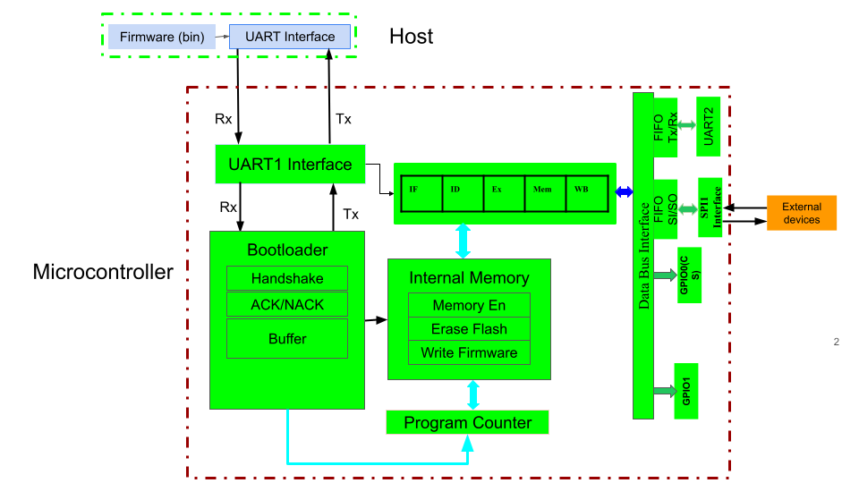

<!---

This file is used to generate your project datasheet. Please fill in the information below and delete any unused
sections.

You can also include images in this folder and reference them in the markdown. Each image must be less than
512 kb in size, and the combined size of all images must be less than 1 MB.
-->

## How it works
 


This project implements a compact 32-bit RISC-V processor with a five-stage pipeline architecture consisting of Instruction Fetch (IF), Decode (ID), Execute (EX), Memory (MEM), and Write-Back (WB) stages. The pipelined design allows multiple instructions to be processed concurrently, improving throughput while maintaining a small hardware footprint.

### Peripheral Interfaces

The system includes the following communication and control interfaces:

1. **UART1:** Bootloader interface for program loading via serial protocol  
2. **UART2:** General-purpose UART communication interface during execution  
3. **SPI Master:** Peripheral communication interface (Mode 0, ~4.17 MHz)  
4. **GPIO1:** General-purpose output (LED control or similar)  
5. **GPIO2:** Hardware Chip Select control for SPI slave peripherals  

### Operating Modes

**Bootloader Mode (Reset):** After reset, the processor enters bootloader mode via UART1. Instructions are received serially as bytes through the UART1 RX pin and stored sequentially into instruction memory. Once the bootloader detects the sentinel value (`0xBAADF00D`), it automatically transitions to execution mode.

**Execution Mode:** The processor fetches and executes instructions through the five-stage pipeline. Peripheral access is controlled via memory-mapped I/O registers.

### Clock and Timing Specifications

- **System Clock:** 25 MHz
- **UART Baud Rate:** 115,200 baud with x16 oversampling (both UART1 and UART2)
- **SPI Clock Frequency:** ~4.17 MHz (CLK_DIV = 3, Mode 0: CPOL = 0, CPHA = 0)

### Peripheral Communication

Peripherals are accessed through memory-mapped I/O registers using a **polling-based architecture**. The CPU continuously reads status registers to determine when operations can proceed, rather than using interrupts. This simplifies the design while maintaining deterministic behavior.

The SPI master interface supports full-duplex communication with external peripherals such as sensors or external memory devices via dedicated signals (MOSI, MISO, SCLK, and CS).

---

## Peripheral Address Map & Polling Schemes

### 1. UART2 Control Interface

Memory-mapped registers for UART2 (general-purpose communication):

| Register | Address | Description |
|----------|---------|-------------|
| `UART_TX` | `0x1000_0000` | Write data byte to transmit |
| `UART_RX` | `0x1000_0004` | Read received data byte |
| `UART_TX_STATUS` | `0x1000_0008` | TX buffer status (Bit 0: 1 = ready/empty, 0 = busy) |
| `UART_RX_STATUS` | `0x1000_000C` | RX buffer status (Bit 0: 1 = data available, 0 = empty) |

**Polling Protocol:**
- **TX:** Poll `UART_TX_STATUS` Bit 0 until high, then write to `UART_TX`
- **RX:** Poll `UART_RX_STATUS` Bit 0 until high, then read from `UART_RX`

### 2. SPI Master Control Interface

Memory-mapped registers for SPI master mode (Mode 0):

| Register | Address | Description |
|----------|---------|-------------|
| `SPI_TX` | `0x4000_0000` | Write data byte to transmit |
| `SPI_RX` | `0x4000_0008` | Read received data byte |
| `SPI_TX_STATUS` | `0x4000_0004` | TX status (Bit 0: 1 = idle/ready, 0 = shifting) |
| `SPI_RX_STATUS` | `0x4000_000C` | RX status (Bit 0: 1 = data available, 0 = empty) |

**Polling Protocol:**
- **TX:** Poll `SPI_TX_STATUS` Bit 0 until high, then write to `SPI_TX` to initiate transfer
- **RX:** Poll `SPI_RX_STATUS` Bit 0 until high, then read from `SPI_RX`
- **Timing:** SPI transfers are full-duplex; RX data becomes available after the TX completes

### 3. GPIO Configuration

Memory-mapped GPIO output registers:

| Register | Address | Description |
|----------|---------|-------------|
| `GPIO1` | `0x3000_0000` | General-purpose output (LED or other peripheral control) |
| `GPIO2` | `0x3000_0004` | SPI Chip Select control (typically active-low) |

---

## How to test

The design can be tested using both simulation and hardware deployment.

### Simulation Environment

Use Icarus Verilog and cocotb for functional verification:

1. **Compilation:** Standard testbench compiles the Verilog design with timing parameters
2. **Stimulus:** Apply clock and reset signals; execute functional test sequences
3. **Waveform Analysis:** Use GTKWave to inspect signal transitions, pipeline activity, and register updates

### UART Testing (Bootloading)

1. **Program Loading:** Use UART1 to send a sequence of 32-bit instructions serialized as bytes
2. **Acknowledgment:** Verify the bootloader correctly stores instructions in instruction memory
3. **Sentinel Detection:** Once the sentinel value (`0xBAADF00D`) is received, the bootloader halts and execution begins
4. **Execution Verification:** Monitor pipeline progression, register state changes, and instruction completions

### SPI Testing

1. **External Driver:** An external SPI master drives SCLK, MOSI, and CS signals
2. **Data Observation:** Monitor MISO output from the processor
3. **Timing Verification:** Confirm Mode 0 timing compliance (CPOL=0, CPHA=0)
4. **Data Integrity:** Compare transmitted and received byte streams

### Functional Verification Checklist

- [ ] **Bootloader Integrity:** Confirm UART1 correctly receives binary instruction bytes, populates instruction memory, detects sentinel value `0xBAADF00D`, and transitions to execution mode cleanly
- [ ] **Pipeline Progression:** Verify concurrent execution across IF/ID/EX/MEM/WB stages; confirm dependencies, branches, and register write-backs resolve without hazards
- [ ] **Memory-Mapped I/O Polling:** Validate that the processor correctly handles status polling for UART2 and SPI without deadlocks
- [ ] **SPI-to-UART Relay:** Test the interlock routine under load conditions; ensure no data is dropped and transfers complete reliably

---

## Sample Verification Program: SPI-to-UART Polling Loop

The following assembly routine demonstrates a practical I/O sequence:
- Assert SPI Chip Select (GPIO2)
- Poll and write dummy data (`0xAA`) to SPI
- Poll and read the SPI response byte
- Poll and relay the byte over UART2 to the host
- Repeat for 200 iterations, then release Chip Select

```assembly
# ==============================================================================
# RISC-V MMIO SPI Polling and UART2 Relay Loop
# Target: 32-Bit Pipelined Core (RV32I)
# ==============================================================================

    # --- Setup Base Address Pointers ---
    lui   x10, 0x40000        # x10 = SPI Base Address      (0x4000_0000)
    lui   x18, 0x30000        # x18 = GPIO Base Address     (0x3000_0000)
    lui   x19, 0x10000        # x19 = UART Base Address     (0x1000_0000)
    
    # --- Calculate Register Offsets ---
    addi  x11, x10, 8         # x11 = SPI_RX Data Offset    (0x4000_0008)
    addi  x12, x10, 4         # x12 = SPI_TX Status Offset  (0x4000_0004)
    addi  x13, x10, 12        # x13 = SPI_RX Status Offset  (0x4000_000C)
    addi  x21, x19, 8         # x21 = UART_TX Status Offset (0x1000_0008)
    addi  x14, x18, 4         # x14 = GPIO2 CS Offset       (0x3000_0004)
    
    # --- Initialize Loop Constants ---
    addi  x3,  x0, 1          # x3  = GPIO2 HIGH (CS de-assert)
    addi  x16, x0, 0          # x16 = GPIO2 LOW (CS assert)
    addi  x5,  x0, 200        # x5  = Transfer counter (200 iterations)
    addi  x22, x0, 1          # x22 = Status bit mask (Bit 0)
    addi  x7,  x0, 0xAA       # x7  = Dummy data byte
    
    # --- Assert SPI Chip Select ---
    sw    x16, 0(x14)         # GPIO2 = 0 (CS asserted to peripheral)
    
    loop:
        beq   x5, x0, release_cs   # If counter == 0, exit loop
    
    # --- Wait for SPI TX Ready ---
    wait_spi_tx:
        lw    x6, 0(x12)         # Load SPI_TX_STATUS
        and   x6, x6, x22        # Isolate Bit 0 (ready flag)
        beq   x6, x0, wait_spi_tx # If 0 (busy), loop back
        sw    x7, 0(x10)         # Write 0xAA to SPI_TX, initiate transfer
    
    # --- Wait for SPI RX Data ---
    wait_spi_rx:
        lw    x8, 0(x13)         # Load SPI_RX_STATUS
        and   x8, x8, x22        # Isolate Bit 0 (data available flag)
        beq   x8, x0, wait_spi_rx # If 0 (no data), loop back
        lw    x9, 0(x11)         # Read received byte from SPI_RX
    
    # --- Wait for UART TX Ready ---
    wait_uart_tx:
        lw    x6, 0(x21)         # Load UART_TX_STATUS
        and   x6, x6, x22        # Isolate Bit 0 (ready flag)
        beq   x6, x0, wait_uart_tx # If 0 (busy), loop back
        sw    x9, 0(x19)         # Write SPI byte to UART_TX
    
    # --- Next Iteration ---
        addi  x5, x5, -1         # Decrement counter
        jal   x0, loop           # Jump to next iteration
    
    release_cs:
        sw    x3, 0(x14)         # GPIO2 = 1 (CS de-asserted from peripheral)
        ecall                    # Halt simulation
```

### Compiled Machine Code

Corresponding 32-bit hexadecimal instruction sequence: (link:https://riscvasm.lucasteske.dev/#)

```
0x40000537,  # lui   x10, 0x40000
0x30000937,  # lui   x18, 0x30000
0x100009b7,  # lui   x19, 0x10000
0x00850593,  # addi  x11, x10, 8
0x00450613,  # addi  x12, x10, 4
0x00c50693,  # addi  x13, x10, 12
0x00898a93,  # addi  x21, x19, 8
0x00490713,  # addi  x14, x18, 4
0x00100193,  # addi  x3,  x0, 1
0x00000813,  # addi  x16, x0, 0
0x03200293,  # addi  x5,  x0, 200
0x00300b13,  # addi  x22, x0, 1
0x0aa00393,  # addi  x7,  x0, 0xAA
0x01072023,  # sw    x16, 0(x14)
0x02028663,  # beq   x5, x0, release_cs
0x00752023,  # sw    x22, 0(x12) [wait_spi_tx start - poll]
0x0006a403,  # lw    x6, 0(x12)
0xfe040ee3,  # beq   x6, x0, wait_spi_tx
0x0005a483,  # lw    x8, 0(x10)
0x000aa303,  # lw    x3, 0(x13)
0x01637333,  # and   x6, x6, x22
0xfe031ce3,  # beq   x6, x0, wait_spi_rx
0x0099a023,  # sw    x9, 0(x11)
0xfff28293,  # addi  x5, x5, -1
0xfd9ff06f,  # jal   x0, loop
0x00372023,  # sw    x3, 0(x14) [release_cs]
0x00000073,  # ecall
0xBAADF00D   # SENTINEL VALUE (bootloader halt marker)
```

**Bootloader Operation:** When the bootloader receives the sentinel value `0xBAADF00D`, it:
1. Stops accepting instruction bytes
2. Clears the bootloader hardware state
3. Enables the execution pipeline
4. The processor begins fetching from address 0x0000_0000

---

## External Hardware Requirements

Standard external signals required for operation:

1. **Clock Input:** 25 MHz reference clock
2. **Reset Signal:** Active-low asynchronous reset (`rst_n`)
3. **Enable Signal:** System enable (`ena`) from external controller
4. **UART1 Interface:**
   - RX (input from bootloader tool)
   - TX (output, optional acknowledgment)
5. **UART2 Interface:**
   - RX (input for general communication)
   - TX (output for general communication)
6. **SPI Interface:**
   - MOSI (Master Out, Slave In) — output from processor
   - MISO (Master In, Slave Out) — input to processor
   - SCLK (Serial Clock) — output from processor
   - CS (Chip Select) — output from GPIO2
7. **GPIO1:** General-purpose output (open-drain or push-pull driver)
8. **GPIO2:** Chip Select output for SPI slave (open-drain or push-pull driver)

---

## Notes

- The bootloader expects a **little-endian** byte order for 32-bit instructions
- Status register Bit 0 is the only bit currently used for ready/valid flags
- The SPI interface operates as a master only; peripheral (slave) functionality is not supported
- Interrupt support is not implemented; use polling exclusively for peripheral status checking